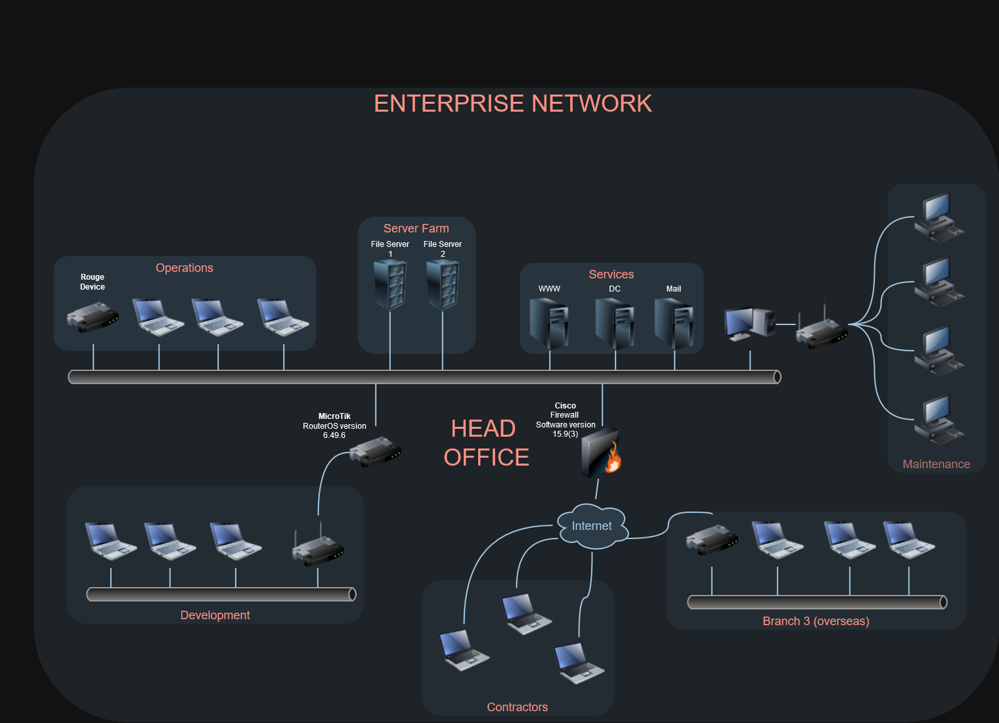

# Arbitr Red Team

---

## Introduction
We are overjoyed that you want to join our team! Below we will be asking you to complete a challenge tailored toward our Red Team role!

In this challenge, you'll be provided with a network map containing incomplete information. The purpose is to evaluate your problem-solving skills and thought process. Below are three scenarios for you to choose from. While completing all scenarios is admirable, we prioritize quality over quantity. Therefore, focus on crafting a well-thought-out solution for the scenario(s) you select.

### Network Map

### Challenge

- One of your on-site teammates has placed a Rogue Device in the Operations subnet. What are the steps you would take to own the Domain?
  
- Your team has conducted a Phishing campaign, and great news... you had a successful click through and even got them to execute your payload! You have been given local administrator permissions to the Development Host Compromised, how would you access and exfil sensitive files from File Server 1?
  
- A Contractor left his box unattended, what would you leverage to gain access to his box. Additionally, once you are in his box how would you gain access to the internal network?

#### Report
Talk us through how you approached the scenario! Please keep the report to 3 pages or less, it can contains things such as...
- Technical Details
- Assumptions
- Approach/Thought Process
- Blockers
- or anything else you deem interesting!

#### Questions/Feedback
Please contact your representative, or email us at employment@arbitrsecurity.com! 
